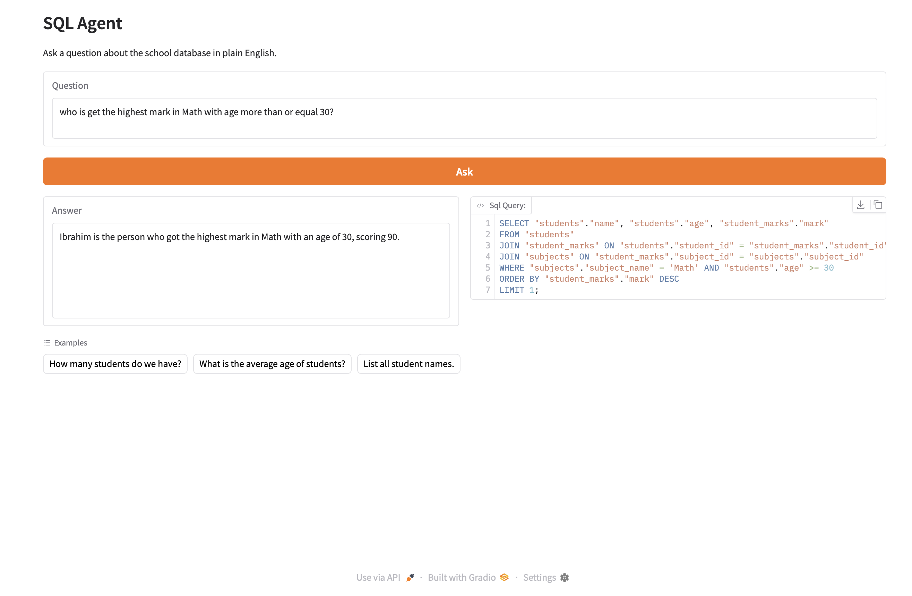

# 🧠 SQL Agent — Text to SQL

Ask questions about a school database in **plain English**. The agent turns your
question into an SQL query using an LLM, runs it against a local SQLite database,
and answers back in natural language — while also showing you the exact SQL it
generated.



---

## ✨ Features

- **Natural language → SQL** — powered by LangChain's `create_sql_query_chain` and OpenAI.
- **Plain-English answers** — the raw SQL result is rephrased into a readable sentence.
- **See the query** — the generated SQL is displayed side-by-side with the answer.
- **Two chain styles** — an imperative `answer()` and a declarative LCEL pipeline `LCEL_Answer()`.
- **Robust SQL parsing** — a `clean_sql` helper strips markdown fences / `SQLQuery:` labels so only a single statement is executed.
- **Simple Gradio UI** — question box, one-click ask, and example prompts.
- **Self-contained data layer** — small Python classes to create and query the schema.

---

## 🏗️ Architecture

```
┌────────────┐   question    ┌──────────────────────┐
│  Gradio UI │ ────────────► │      SQLAgent        │
│  (app.py)  │               │     (agent.py)       │
│            │ ◄──────────── │                      │
└────────────┘  sql + answer └──────────┬───────────┘
                                         │
                       1) LLM writes SQL │ create_sql_query_chain
                       2) run SQL        │ SQLDatabase
                       3) LLM rephrases  │ ChatOpenAI
                                         ▼
                                  ┌─────────────┐
                                  │  school.db  │  (SQLite)
                                  └─────────────┘
```

**Flow (both `answer()` and `LCEL_Answer()`):**

1. The question is sent to the LLM, which generates an SQL query.
2. The query is passed through `helper.clean_sql()` to strip fences / labels and keep a single statement.
3. The clean query runs against `school.db`.
4. The question + result are fed back to the LLM, which returns a plain-English answer.
5. Both the SQL and the answer are returned to the UI.

`agent.py` offers two implementations of this flow:

- **`answer()`** — imperative: calls each step manually (`chain.invoke` → `db.run` → `llm.invoke`).
- **`LCEL_Answer()`** — declarative LCEL pipeline using `RunnablePassthrough.assign(...)` to build up
  `{question, query, result, answer}` in one composed chain. This is the method the UI currently calls.

---

## 🗂️ Project Structure

| File | Purpose |
|------|---------|
| `app.py` | Gradio web UI — wires the input box to `SQLAgent.LCEL_Answer()`. |
| `agent.py` | `SQLAgent` — the text-to-SQL logic (LangChain + OpenAI); `answer()` and `LCEL_Answer()`. |
| `helper.py` | `clean_sql()` — normalizes LLM output down to one runnable SQL statement. |
| `sql/SQLManager.py` | Creates the SQLite connection and the `students`, `subjects`, `student_marks` tables. |
| `sql/Student.py` | CRUD for students. |
| `sql/Subject.py` | Create / list subjects. |
| `sql/Mark.py` | Add / list student marks. |
| `school.db` | SQLite database file. |

### Database schema

- **students** — `student_id`, `name`, `age`
- **subjects** — `subject_id`, `subject_name`
- **student_marks** — `id`, `student_id` → students, `subject_id` → subjects, `mark`

---

## 🚀 Getting Started

### 1. Requirements

- Python 3.12
- An OpenAI API key

### 2. Install dependencies

```bash
pip install -r requirements.txt
```

### 3. Configure your API key

Create a `.env` file in the project root:

```env
OPENAI_API_KEY=sk-your-key-here
```

> `.env` is git-ignored, so your key stays out of version control.

### 4. (First run) Create and seed the database

```bash
python -m sql.SQLManager   # creates the tables
python -m sql.Student      # adds sample students
python -m sql.Subject      # adds sample subjects
python -m sql.Mark         # adds sample marks
```

### 5. Launch the app

```bash
python app.py
```

Open the URL Gradio prints (default **http://127.0.0.1:7860**).

---

## 💬 Example Questions

- "How many students do we have?"
- "What is the average age of students?"
- "Who got the highest mark in Math with age more than or equal to 30?"
- "List all student names."

---

## ⚠️ Notes

- Every question makes live OpenAI API calls, which may incur cost.
- The agent generates and executes SQL against a **local** database — do not point it
  at a production database without adding proper safeguards.
